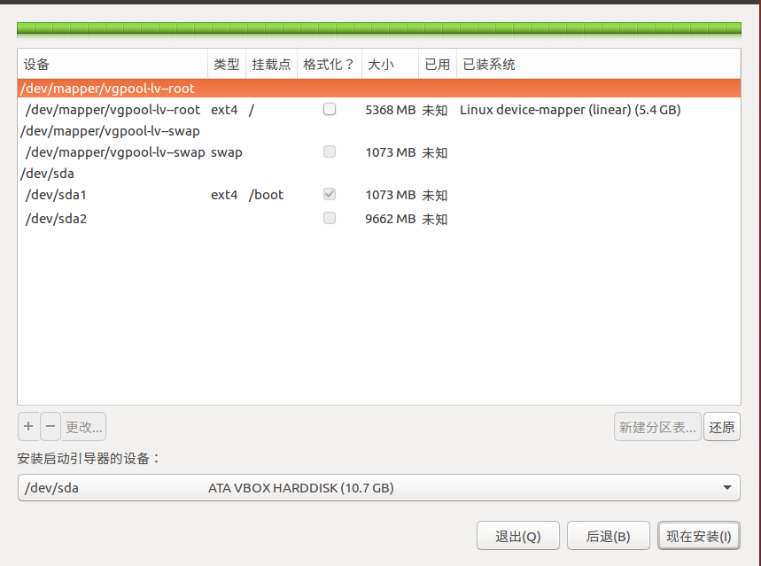

#LVM 相关
[教程](https://wiki.archlinux.org/index.php/LVM_(%E7%AE%80%E4%BD%93%E4%B8%AD%E6%96%87)#LVM.E5.9F.BA.E6.9C.AC.E7.BB.84.E6.88.90)
#### 1. LVM 概念

#### 2. 创建物理卷

##### 2.1 物理分区
```sh
fdisk /dev/sda　

n    #创建新分区
p    # 主分区

a    # 设置为活动分区　boot分区, 不能使用LVM分区，直接使用物理分区

t    # 设置磁盘格式 Linux LVM 

```

#### 3. 创建LVM分区

##### 3.1 创建PV(物理卷)
```sh
pvcreate /dev/sda2  #在Linux LVM物理分区上创建物理卷
```

##### 3.2 创建VG(卷组)
```sh
vgcreate vgpool /dev/sda2 # vgpool是卷组的名称，　/dev/sda2是物理卷
```

##### 3.3 创建LV(逻辑卷)
```sh
lvcreate -L +5G -n lv-root vgpool # 创建逻辑卷，分配5G空间，名称叫做lv-root，从vgpool卷组获取空间,　path : /dev/vgpool/lv-root

lvcreate -L +1G -n lv-swap vgpool  #交换空间

mkfs -t ext4 /dev/vgpool/lv-root  #格式化逻辑卷，生成文件系统
```

#### 4. 安装系统



#### 5. 扩展LV
*系统在使用也可以扩展*
```sh
pvcreate /dev/sdb1  # 新建pv

vgextend vgpool /dev/sdb1 # vgpool : 要扩展的卷组，/dev/sdb1 : 添加的pv

lvextend -L +10G /dev/vgpool/lv-root  # 扩大lv-root　10G

lvextend -L +2G /dev/vgpool/lv-swap  # 扩大lv-swap 2G

resize2fs /dev/vgpool/lv-root #刷新文件系统信息
# 应用swap分区
swapoff /dev/vgpool/lv-swap  #关闭swap分区
mkswap /dev/vgpool/lv-swap  #建立swap 分区
swapon /dev/vgpool/lv-swap  # 打开swap 分区
```
